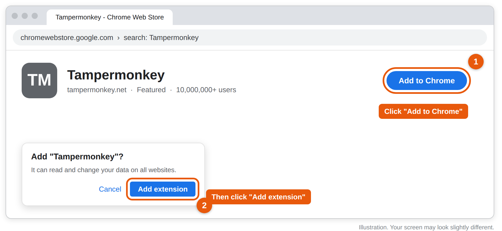
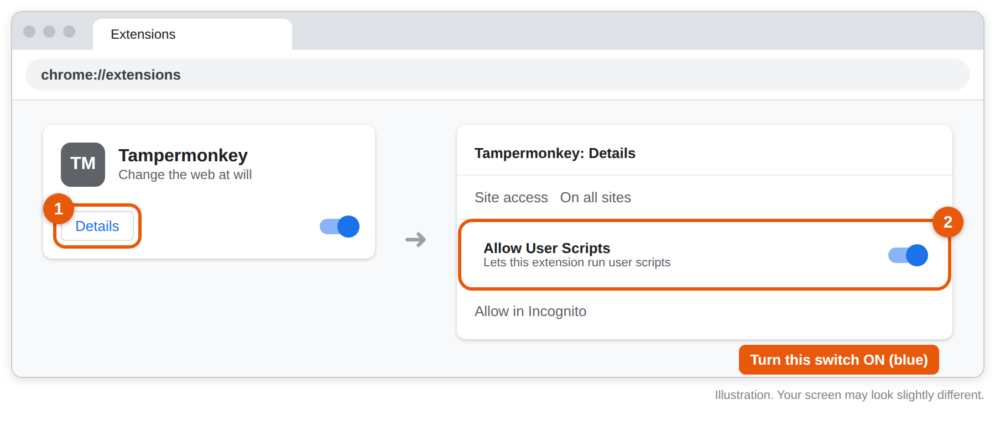
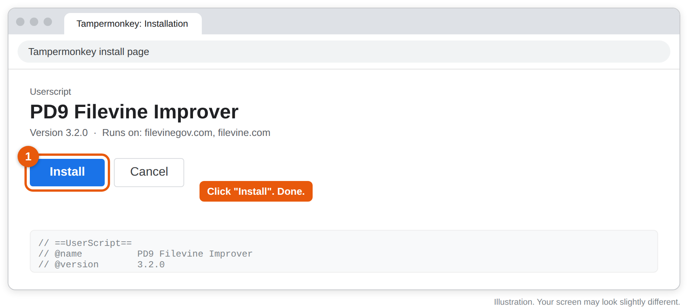
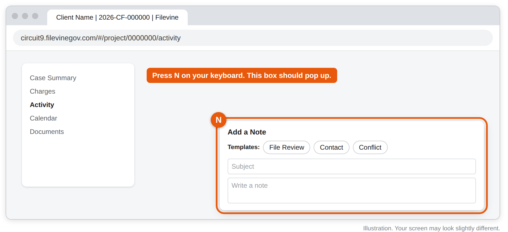

# PD9 Filevine Improver

Makes notes and tasks in Filevine faster. Setup takes about 3 minutes and you only do it once.

### [➜ Click here to install](https://raw.githubusercontent.com/YOUR-GITHUB-USERNAME/pd9-filevine-improver/main/pd9-filevine-improver.user.js)

Do Steps 1 and 2 below first, or the link will just show a page of code.

## What it does

| Key or button | What happens |
| --- | --- |
| **N** | Opens a note box anywhere in a case |
| **T** | Opens a task box, due the next business day |
| **Templates** | File Review, Contact, Conflict: fills in the date, outline, and tag |
| **Ctrl+Enter** | Saves the note or task |
| **Restore note** | Brings back text if you closed the box by mistake |

It also opens cases from the Project Hub straight to the Activity page, and hides the Trending Tags box.

## Install (Google Chrome)

If Chrome asks for an admin password or blocks the add-on, stop and contact IT.

### Step 1: Add Tampermonkey to Chrome

Tampermonkey is a free Chrome add-on that runs the script.

1. Go to [chromewebstore.google.com](https://chromewebstore.google.com) and search for **Tampermonkey**.
2. Open the one made by **tampermonkey.net** and click **Add to Chrome**.
3. A small box pops up. Click **Add extension**.

### Step 2: Turn on "Allow User Scripts"

Chrome blocks scripts until you flip one switch. This is the step most people miss.

1. Click the address bar, type `chrome://extensions`, and press Enter.
2. Find Tampermonkey and click **Details**.
3. Turn on **Allow User Scripts** (the switch turns blue).

Don't see that switch? Your Chrome is older. Turn on **Developer mode** in the top-right corner of the same page instead.

### Step 3: Install the script

1. Click the **[install link](https://raw.githubusercontent.com/YOUR-GITHUB-USERNAME/pd9-filevine-improver/main/pd9-filevine-improver.user.js)**.
2. A Tampermonkey page opens showing **PD9 Filevine Improver**. Click **Install**.

Updates install on their own after this. You never need to do it again.

### Step 4: Test it

1. Go to Filevine and reload the page (F5, or Cmd+R on a Mac).
2. Open any case, click a blank spot on the page, and press **N**.
3. A note box with **Templates: File Review, Contact, Conflict** should pop up.

*Pictures are illustrations. Your screen may look slightly different.*

## If something's not working

| Problem | Fix |
| --- | --- |
| Pressing N does nothing | Reload Filevine. Click a blank spot first, since N is ignored while you're typing in a box. |
| Still nothing after reloading | Redo Step 2. The Allow User Scripts switch is usually the cause. |
| The install link shows a page of code | Tampermonkey isn't installed or turned on. Redo Steps 1 and 2, then click the link again. |
| Template buttons show up twice | An old copy is installed. Click the Tampermonkey icon, open the **Dashboard**, and delete "Filevine Quick Notes". |

Still stuck? [Open an issue](https://github.com/YOUR-GITHUB-USERNAME/pd9-filevine-improver/issues) or ask your coordinator.

---

## For the maintainer

**Releasing an update**

1. Edit `pd9-filevine-improver.user.js`.
2. **Raise the `@version` number** at the top (for example 3.2.1 to 3.2.2). Tampermonkey only updates people when this number goes up.
3. Commit to the `main` branch. Everyone gets the update within about a day, or right away if they click the Tampermonkey icon, then **Utilities**, then **Check for userscript updates**.

**Settings** are near the top of the script: templates, hotkeys (N and T), the default task due date, weekend skipping, and draft limits.

**Notes**

- The repo must be **public** for the install link and auto-updates to work. The script holds no client data.
- Anyone with write access to this repo can change code that runs in everyone's Filevine. Keep write access limited.
- Unofficial tool. Not made or supported by Filevine.
